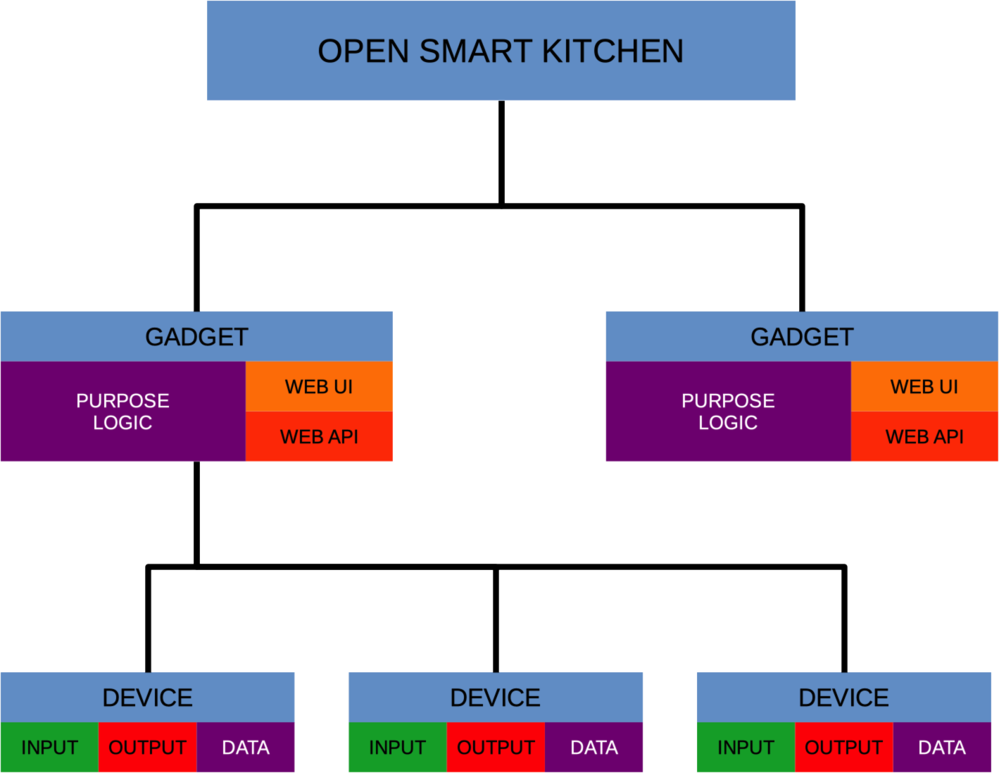

# OSK-Core

_OSK-Core is part of the development software for the [Hackaday ÓSK Squirrel](https://hackaday.io/project/165563-sk-squirrel) project._

## Project Overview
Whether squirrel or human, the food cycle of foraging, stashing, preparing, consuming, sharing and foraging again is a complicated, time-consuming process. Coordinating with the whole family makes for some dramatic chatter.

There needs to be a “hub” that can process data locally that gives users control and respects user privacy. An open solution needs to be created before big business dominates the kitchen.

We are working on a software framework that will run locally on a smart kitchen device. While we will provide an example hardware device, we hope others can use this framework to hack the kitchen with networked devices from the pantry to the fridge.

Read more on [Hackaday.io](https://hackaday.io/project/165563-sk-squirrel).

## Software Structure
Each smart kitchen has a collection of smart gadgets (appliances, pantries, etc.).  Each smart gadget is composed of one or more devices.  These devices all store some data (camera data, weight data, humidity, etc.) and can act either as an input and/or output for the gadget.

Different gadgets in the OSK ecosystem can talk to each other, but they cannot directly access another gadget's device.  If data needs to be shared, the appropriated API should be incorporated into the host device's logic.

